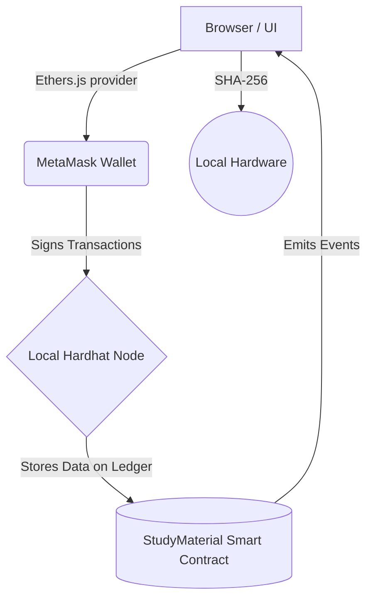

# ChainEdu: Decentralized Study Material DApp


**ChainEdu** is a modern, fully decentralized Web3 application (DApp) designed to securely store, manage, and verify educational study materials. By leveraging Ethereum smart contracts, local cryptographic hashing (SHA-256), and decentralized storage concepts, it ensures that educational documents are immutable, timestamped, and mathematically protected against unauthorized tampering.

---

## System Architecture

The ecosystem relies on an interaction between a client-side frontend, a browser wallet, and an EVM-compatible blockchain.



### Components:
1. **Frontend UI**: Built with pure HTML/CSS/JS featuring a premium glassmorphic dark-mode design. It uses native `crypto.subtle` APIs for fast, client-side zero-knowledge document hashing.
2. **Blockchain Layer**: Powered by **Hardhat**. It runs a local Ethereum node (`127.0.0.1:8545`) simulating real network conditions without requiring real money.
3. **Smart Contract (`StudyMaterial.sol`)**: Written in Solidity `^0.8.20`. It handles structs for Document Metadata, versioning mechanisms for tracking document history, and the core cryptographic verification function.
4. **Middleware (`Ethers.js v6`)**: Bridges the HTML frontend to the Smart Contract via MetaMask.

---

## Features
*   **Immutable Uploads:** Users can upload documents. The file's unique digital fingerprint (Hash) is permanently written to the ledger.
*   **Decentralized Verification:** A zero-party verification system where users can drop their local file into the DApp, and the system proves its authenticity by cross-checking the local hash against the blockchain's immutable record.
*   **Version Control:** An integrated history system allowing the original uploader (and only the original uploader) to append new revisions to a document, retaining the CID and Hash of every past version.
*   **Auto-Network Switching:** The DApp automatically prompts MetaMask to switch to the local Developer Network upon connection, eliminating manual UI configuration errors.

---

## Prerequisites

Before you begin, ensure you have installed the following:
1. **Node.js** (v18+ recommended)
2. **MetaMask Extension** installed in your browser (Chrome/Brave/Edge).
3. **Git Bash / VS Code Terminal** for running commands.

---

## How to Run the Project (Step-by-Step)

Follow these precise steps to launch the local blockchain, deploy the infrastructure, and start the graphical interface.

### Step 1: Install Dependencies
Open your terminal in the root directory of the project and install Hardhat and Ethers components:
```bash
npm install
```

### Step 2: Start the Local Blockchain Node
In your terminal, boot up the local Ethereum network. **Leave this terminal open and running!**
```bash
npx hardhat node
```
*(This will generate 20 fake Ethereum accounts with 10,000 ETH each).*

### Step 3: Fund Your MetaMask Wallet
Open a **new, split terminal** in VS Code (Keep the node from Step 2 running).
Because MetaMask generates its own unique wallet address, we must send it test ETH so you can comfortably pay for Gas fees during the demo.
Open the `scripts/fund.js` file and ensure the `TARGET_ADDRESS` matches your MetaMask Wallet address. Then run:
```bash
npx hardhat run scripts/fund.js --network localhost
```
*(You will instantly receive 5,000 ETH in your MetaMask wallet).*

### Step 4: Deploy the Smart Contract
Now, permanently write the `StudyMaterial.sol` application code to your local blockchain:
```bash
npx hardhat run scripts/deploy.js --network localhost
```
**CRITICAL:** The terminal will output an address, e.g., `StudyMaterial deployed to: 0x5FbDB2315678afecb367f032d93F642f64180aa3`. 
Copy this generated address, open `frontend/app.js`, and paste it into the `CONTRACT_ADDRESS` constant at the very top of the file!

### Step 5: Start the DApp Frontend
In that same terminal, host the frontend directory using the `serve` package:
```bash
npx serve frontend
```
*(The DApp will open at `http://localhost:3000`)*.

---

## 🦊 Connecting MetaMask

1. Go to `http://localhost:3000`.
2. Click **Connect Wallet** in the top right.
3. Your MetaMask extension will automatically pop up asking permission to add the **"Hardhat Local"** network (`Chain ID: 31337`). 
4. Approve the network switch.
5. Your MetaMask will now display your 5,000 ETH balance, and the DApp is ready to use!

---

## Troubleshooting & Common Issues

*   **"MetaMask throws a red 'Review alert'"**: This is completely normal because `localhost:3000` runs on `http://` rather than secure `https://`. You can safely click the alert and hit **Confirm** to proceed.
*   **"Error: could not decode result data (value='0x')"**: This means your `app.js` is using a contract address that does not exist. This happens if you accidentally closed the `npx hardhat node` terminal, which wipes the blockchain.
    *   *Fix:* Restart your node (Step 2), re-deploy the contract (Step 4), update `app.js` with the new address, and refresh the webpage.
*   **RPC Error / Nonce too high**: If you restart your Node but your MetaMask account gets stuck with queued transactions, go to `MetaMask Settings -> Advanced -> Clear activity tab data` to reset it.

---
*Sharath & Om*